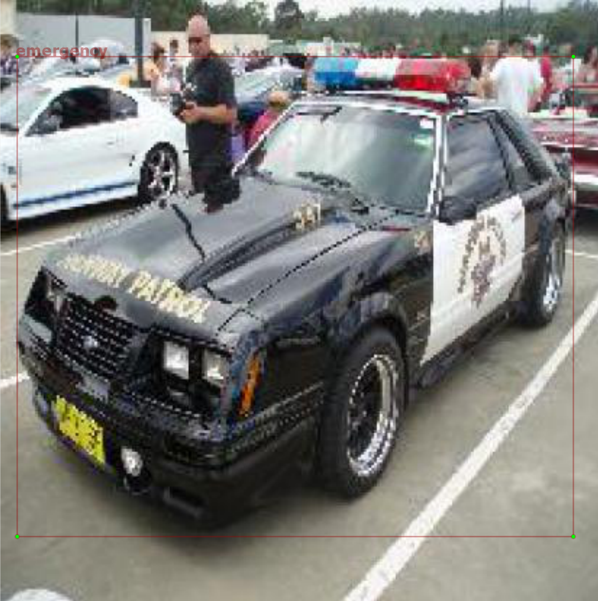
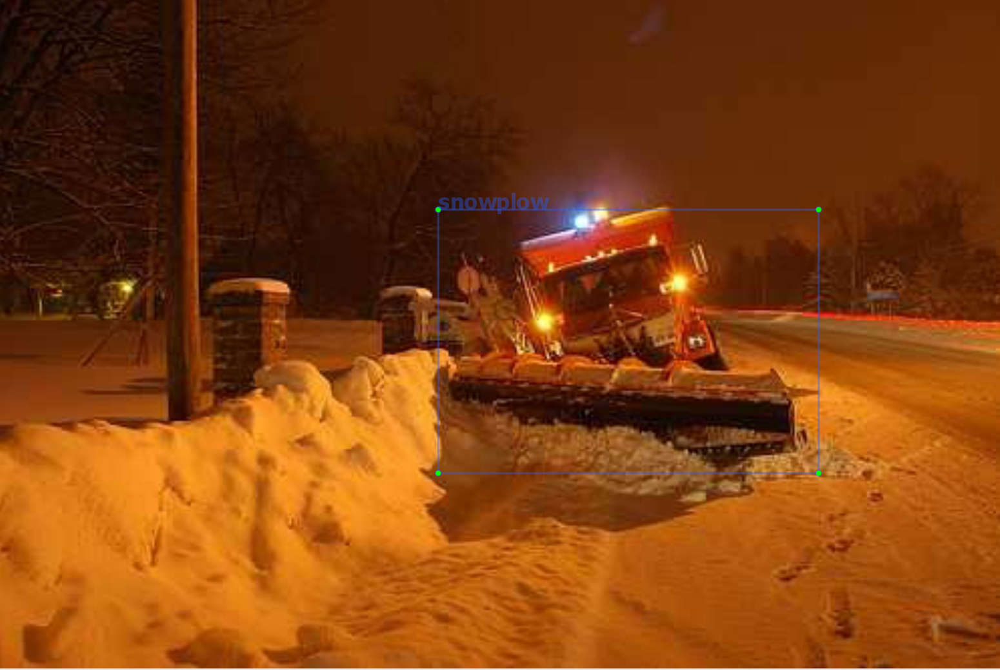
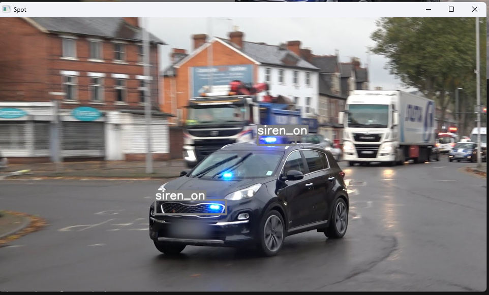
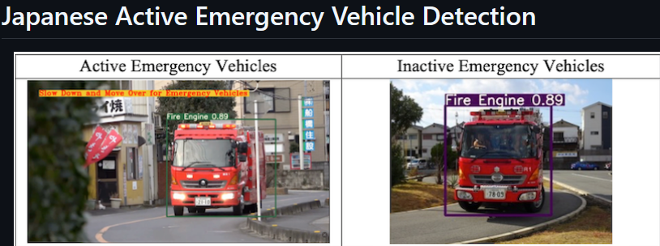
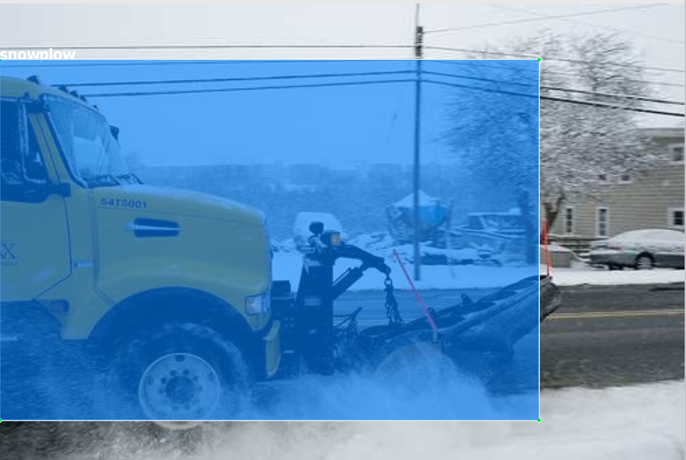
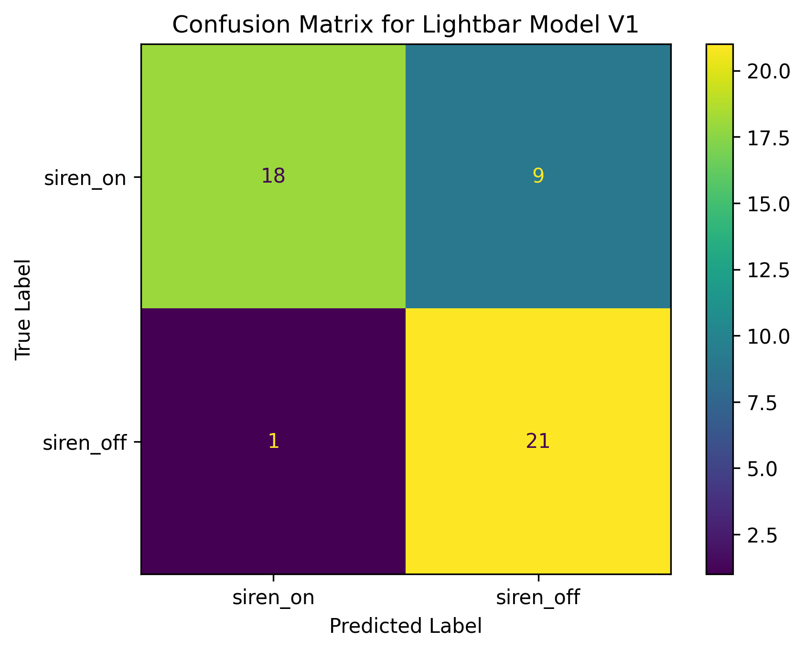
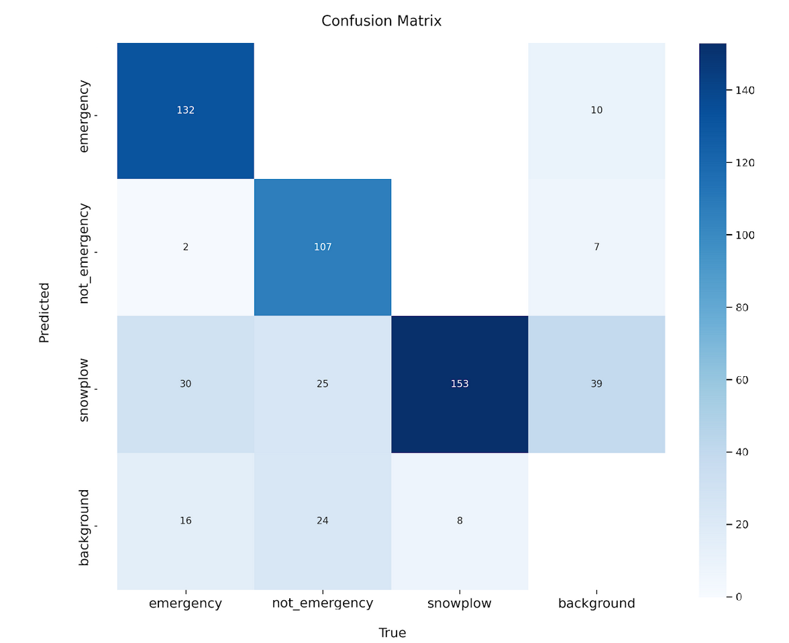

# Enhanced-Driver-Assistance

# Enhanced Driver Assistance: Emergency Vehicle Detection (Vision-Only)

Lightweight computer-vision approach to detect emergency vehicles (fire, ambulance, police) and their **active status** (lightbar on/off) from images. Built around YOLOv8n and curated datasets; goal is real-time driver assistance on constrained hardware.

> Report PDF: [`report/Report.pdf`](report/Report.pdf)

## Highlights
- Two-model design tested: vehicle detector + lightbar detector (sequential and parallel setups).
- YOLOv8n chosen for speed/accuracy trade-off; YOLOv11 was ~10× slower in our tests.
- ~2.6k images corrected/relabeled; augmentations to improve robustness.
- Key limitation: single-frame vision (no temporal cues), class imbalance.

See the paper for full details and results. :contentReference[oaicite:0]{index=0}

## Example results

### Inputs

  
  
  

### Detections

  
  
  

### Confusion matrices

  
  

> Figure captions and numeric results are summarized in [`results/metrics.md`](results/metrics.md).

## Data
We use public datasets for emergency vehicles, siren lights, and snowplows. We **do not** redistribute raw data.  
See [`data/DATASET_SOURCES.md`](data/DATASET_SOURCES.md) for links and licenses.

## Project layout
